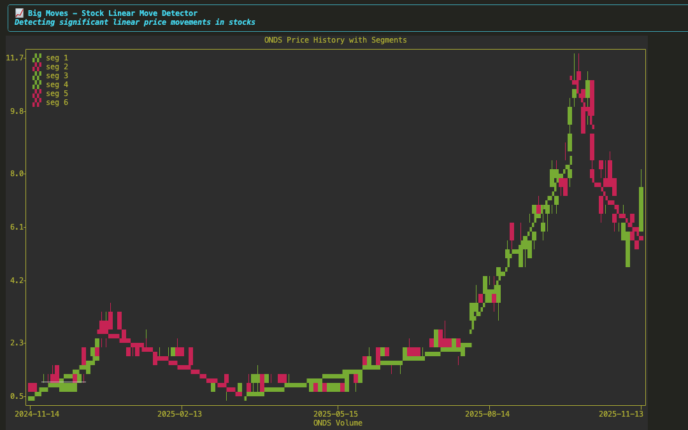
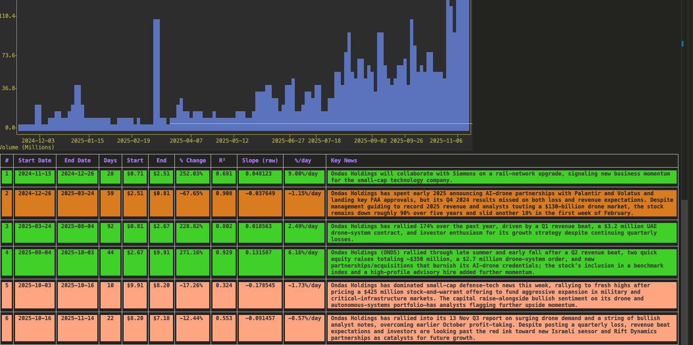

# Big Moves






A CLI application to trace the relationship between financial media narrative and price movements of stocks. Uses segmented linear regression to identify and highlight big moves and summarizes the news flow progressing through segments.


**Use this to :** 

1. To observe the reflexive interplay between price and narrative
2. To quickly understand the story behind a stock. 

## Features

- Divides chart into segments using segmented linear regression and highlights big moves.
- Summarizes news narrative as we progress trough the segments.
- Configurable percentage threshold for what constitutes a big move
- Customizable time window for analysis

## Quick Start


```bash
# Setup your environment (see SETUP.md for detailed instructions)
uv venv
source .venv/bin/activate
uv pip install -r requirements_dev.txt
uv pip install -e . 
```

## Usage

Grab an api key from groq.


Update at least `GROQ_API_KEY` using 

```bash
big-moves config set --all

```

Optional debug logging for summarizer prompts:

```bash
# In your .env (project cwd or global config):
BIG_MOVES_DEBUG_PROMPTS=true
```
When enabled, the app logs model hint selection, budgets, and prompts (stdout). Leave unset/false for normal runs.

Analyze US listed stocks: 


```bash
big-moves run <TICKER> [OPTIONS]
```


```bash
 big-moves run ONDS --max_segments 6 --min_points 6 --detailed_news --big_move_threshold 30.0  
```
